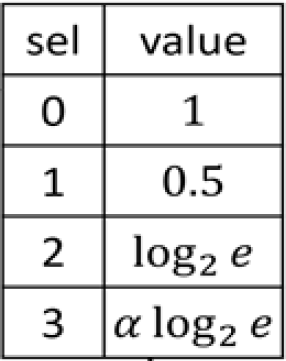
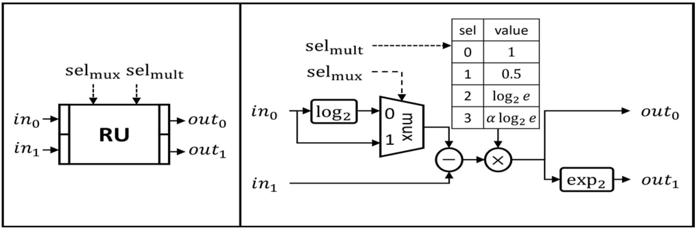
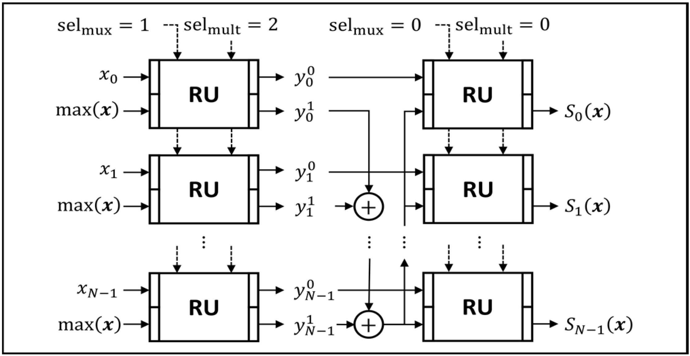

# Softmax Function Approximation Implement in Python

This document is based on [[1]](#references).  
It implements and explains the paper’s proposed approach for approximating the Softmax function in a hardware-friendly way.

This design replaces expensive operations like division and exponentials with simple, modular components using shifts, additions, and look-up tables (LUTs).

I will show the individual module implementations (LUT and RU), as well as the combined logic for Softmax function approximation.  
Finally, I will compare the approximation results to the standard Softmax output.

## 0. Apprioximation Formula

### [How to apprioximate?](./HowToApproximate.md)

## I. LUT
This function models the **Look-Up Table (LUT)** used in [[1]](#references)'s **Reconfigurable-Unit (RU)** design.  
The RU stores pre-defined multiplication constants in advance, allowing it to quickly select and apply the appropriate scaling factor without expensive operations.

### Input/Output
- Inpurt : `sel_mult` (`INT32`)
- Output : `constant` (`FP32`)

### Selector Index Mapping
- 0 : No scaling (returns 1)
- 1 : Scaling by 0.5 (used for square root approximations)
- 2 : Scaling by $\log_2e \approx 1.4427$ (for exponential function approximation)
- 3 : Scaling by $\alpha\cdot\log_2e \approx 2.5709$ (a tuned constant for GELU approximation in [[1]](#references))

### Layout


### Code

```py
def LUT(sel_mult):
    if sel_mult == 0:
        return 1
    elif sel_mult == 1:
        return 0.5
    elif sel_mult == 2:
        return 1.442695041  # log2(e)
    elif sel_mult == 3:
        return 2.570882563  # alpha*log2(e)
```

## II. RU

Reconfigurable Unit (RU) Function
    
This function implements the **core arithmetic block** used in [[1]](#references)'s reconfigurable design.

The RU supports two modes of operation:
- `sel_mux = True`  : performs subtraction for input preprocessing
- `sel_mux = False` : performs transform domain to exp with log2-based normalization

After subtraction/log2, the result is scaled by a selectable multiplier (sel_mult),
then transformed via $2^x$ to approximate exponential behavior.

### Input
- **Data**
    - `in_0` : First input operand (`FP32`)
    - `in_1` : Second input operand (`FP32`)

- **Selelctors**
    - `sel_mux` : `bool`
        - Mode selector:
            - `True`  : subtraction mode
            - `False` : log2 normalization mode

    - `sel_mult` : `INT32`
        - Multiplier selector controlling LUT scaling.
            - 0 : No scaling
            - 1 : Scaling by 0.5
            - 2 : Scaling by $\log_2e \approx 1.4427$
            - 3 : Scaling by $\alpha\cdot\log_2e \approx 2.5709$

### Ouput
    
- list of `[out_0, out_1]`
    - `out_0` : intermediate result after subtraction/log2 and scaling
    - `out_1` : final result after $2^x$ operation (exp approximation)

### Layout


### Code

```py
def RU(in_0, in_1, sel_mux, sel_mult):
    # Subtraction or log2-based normalization
    if sel_mux:
        # sel_mux = True: simple difference for shift (x_i - max(x))
        out_0 = in_1 - in_0
    else:
        # sel_mux = False: log2 correction (log2(exp_sum) - y_i)
        # Ensuring input is positive for log2 domain
        out_0 = in_1 - np.log2(in_0)

    # Scaling via selected LUT constant
    out_0 = out_0 * LUT(sel_mult)

    # Exponential approximation via 2^x
    # It can approximate to add and shift operation
    out_1 = 2 ** (out_0)

    return [out_0, out_1]
```

## III. approx2_softmax Function

This function implements a **two-stage approximation of the softmax operation**, mirroring the approach described in the paper’s reconfigurable design.

### Purpose
I want to ultimately calculate $2^{x_j'\cdot\log_2 e - \log_2 \left(\sum_{i=0}^{N-1} e^{x_i'}\right)}$.  
In the first stage, I will compute $x_j'\cdot\log_2 e$ and approximate $2^{x_j'\cdot\log_2 e} \approx e^{x_j'}$.  
Before the second stage, I will calculate the sum of $e^{x_i'}$.  
In the second stage, I will transform $\sum e^{x_i'}$ to the log2 domain using normalization, and subtract it from $x_j'\cdot\log_2 e$ (without divison).  
Finally, using the $2^x$ operation, I will obtain the result $2^{x_j'\cdot\log_2 e - \log_2 \left(\sum_{i=0}^{N-1} e^{x_i'}\right)}$.


### Main Logic
1. **Stage 1**
    - Uses RU in `sel_mux=True`
    - For each input `x_i`, computes:
        - `(x_i - max(x)) * log2(e)`
        - Approximates exp via $2^x$
    - Accumulates sum of exponentials

2. **Stage 2**
    - Uses RU in `sel_mux=False`
    - For each transformed value `y_i`, computes:
        - Normalized value by correcting with log2(sum of exponentials)
        - Final result via $2^x$

### Input
- `x` : array (`FP32`)
    - Input logits vector

### Output
- `output` : NumPy array (`FP32`)
    - Approximated softmax probability distribution

### Layout


### Code

```py
def approx2_softmax(x):
    x = np.array(x, dtype=np.float32)
    y = np.empty(x.size, dtype=np.float32)
    output = np.empty(x.size, dtype=np.float32)

    # Stage 1: Max-subtraction and exponentiation approximation
    x_max = np.max(x)
    sum_exp = 0
    for i in range(x.size):
        out = RU(x_max, x[i], True, 2)
        y[i] = out[0]
        sum_exp += out[1]

    # Stage 2: Normalization
    for i in range(y.size):
        out = RU(sum_exp, y[i], False, 0)
        output[i] = out[1]

    return output
```

## IV. References

[1] Q.-X. Wu, C.-T. Huang, S.-S. Teng, J.-M. Lu, and M.-D. Shieh,  
“A Low-complexity and Reconfigurable Design for Nonlinear Function Approximation in Transformers,”  
in Proc. IEEE International Symposium on Circuits and Systems (ISCAS), 2025.