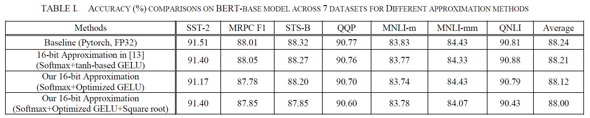

# Softmax Function Approximation Comparison



### Code

```py
def get_SST2_BERT_logits():
    # 1. Model Preparation
    model_name = "textattack/bert-base-uncased-SST-2"
    # Model name to load
    tokenizer = BertTokenizer.from_pretrained(model_name)
    # Load the tokenizer compatible with the model
    # Returns a tokenizer object
    model = BertForSequenceClassification.from_pretrained(model_name)
    # Load the BERT model fine-tuned on SST-2
    # Returns a model object

    model.eval()  # Set the model to evaluation mode

    # 2. Load all SST-2 validation samples
    # SST-2 samples are available via Hugging Face
    # Use load_dataset from datasets
    dataset = datasets.load_dataset("glue", "sst2", split="validation")
    # "validation" → loads 872 evaluation samples
    sentences = dataset["sentence"]
    # Sentence samples
    true_labels = np.array(dataset["label"])
    # Ground truth labels

    print(f"Loaded {len(sentences)} SST-2 samples.")
    # Confirm loading of the entire dataset

    # 3. Tokenize sentences
    inputs = tokenizer(sentences, return_tensors="pt", padding=True, truncation=True)
    # Use the loaded tokenizer
    # inputs = {
    #       "input_ids": Tensor1,
    #       "attention_mask": Tensor2
    #   }
    # Tensor1: token ID sequences for each sentence
    # Tensor2: attention mask indicating which tokens are padding (0) vs real (1)
    # Returns a dictionary (Key-Value pairs)

    with torch.no_grad():
        # Disable gradient tracking in this block
        # Turns off autograd engine
        # No backpropagation is performed
        # Used only for inference (prediction)
        outputs = model(
            input_ids=inputs["input_ids"],
            attention_mask=inputs["attention_mask"],
        )
        # outputs = SequenceClassifierOutput(
        #       loss=None (or value),
        #       logits=Tensor,
        #       hidden_states=None,
        #       attentions=None
        #   )
        # logits is a tensor containing predicted score vectors for each sentence
        logits = outputs.logits.numpy()
        # Convert the tensor to a NumPy array

    return [logits, true_labels]
```

```py
def evaluate_SST2_softmax_accuracy():
    logits, true_labels = get_SST2_BERT_logits()
    # Compare predicted labels
    correct_basic = 0
    correct_approx = 0
    match_count = 0

    for idx, logit in enumerate(logits):
        std_probs = baseline_softmax_Pytorch_FP32(logit)
        approx_probs = approx2_softmax(logit)
        std_label = np.argmax(std_probs)
        approx_label = np.argmax(approx_probs)
        true_label = true_labels[idx]

        # Measure accuracy
        # Compare with ground truth
        if std_label == true_label:
            correct_basic += 1
            print("[O", end="")
        else:
            print("[X", end="")

        if approx_label == true_label:
            correct_approx += 1
            print("O]", end="")
        else:
            print("X]", end="")

        if idx % 20 == 19:
            print()

        # Check label agreement between standard and approximate softmax
        if std_label == approx_label:
            match_count += 1

    # Summary of overall accuracy
    total = len(logits)
    acc_basic = correct_basic / total * 100
    acc_approx = correct_approx / total * 100
    label_match_rate = match_count / total * 100

    print("\n=====Evaluation Results=====")
    print(f"Standard Softmax Accuracy : {acc_basic:.3f}% ({correct_basic}/{total})")
    print(f"Approximate Softmax Accuracy: {acc_approx:.3f}% ({correct_approx}/{total})")
    print(
        f"Label Match Rate (Std vs Approx): {label_match_rate:.3f}% ({match_count}/{total})"
    )
```

```
Loaded 872 SST-2 samples.
[OO][OO][OO][OO][OO][OO][OO][OO][OO][OO][OO][OO][OO][XX][OO][OO][OO][OO][OO][OO]
[OO][OO][XX][OO][OO][OO][OO][OO][OO][OO][OO][OO][OO][OO][OO][OO][OO][OO][OO][OO]
[OO][OO][OO][OO][OO][OO][XX][OO][OO][OO][OO][OO][OO][OO][OO][OO][OO][OO][XX][OO]
[OO][OO][OO][OO][OO][OO][OO][OO][OO][XX][OO][OO][OO][OO][OO][OO][OO][OO][OO][OO]
[OO][OO][OO][OO][OO][OO][OO][OO][OO][OO][OO][OO][XX][XX][OO][XX][OO][OO][OO][OO]
[OO][OO][OO][OO][OO][OO][OO][OO][OO][OO][OO][OO][XX][OO][OO][XX][OO][OO][XX][OO]
[OO][XX][OO][OO][OO][OO][OO][OO][OO][OO][OO][OO][OO][OO][OO][OO][OO][OO][OO][OO]
[OO][OO][XX][XX][OO][OO][OO][OO][OO][OO][OO][OO][OO][OO][OO][OO][OO][OO][OO][OO]
[OO][OO][OO][OO][OO][OO][OO][OO][OO][OO][OO][XX][XX][OO][OO][OO][OO][OO][OO][OO]
[OO][OO][OO][XX][OO][OO][OO][OO][OO][OO][OO][OO][OO][OO][OO][OO][OO][OO][OO][OO]
[OO][OO][OO][OO][OO][XX][OO][OO][OO][OO][OO][OO][OO][OO][OO][OO][OO][OO][OO][OO]
[OO][OO][OO][OO][OO][OO][OO][OO][OO][OO][XX][OO][OO][OO][OO][OO][OO][OO][OO][OO]
[OO][OO][OO][OO][OO][OO][OO][OO][XX][OO][OO][OO][OO][OO][OO][OO][OO][OO][OO][OO]
[OO][OO][OO][OO][OO][OO][XX][OO][OO][OO][OO][XX][OO][XX][OO][OO][OO][OO][OO][OO]
[OO][OO][XX][OO][OO][OO][OO][OO][OO][OO][OO][OO][XX][OO][OO][OO][OO][OO][OO][OO]
[OO][OO][OO][OO][OO][OO][OO][OO][OO][OO][OO][OO][XX][OO][OO][OO][OO][OO][OO][OO]
[OO][OO][OO][OO][OO][OO][OO][OO][OO][OO][OO][OO][OO][OO][OO][OO][OO][OO][OO][OO]
[OO][OO][OO][OO][OO][OO][OO][OO][OO][OO][OO][OO][OO][OO][OO][OO][OO][OO][XX][OO]
[OO][OO][OO][OO][OO][OO][OO][OO][OO][OO][OO][OO][OO][OO][OO][OO][OO][OO][OO][OO]
[OO][OO][OO][OO][OO][OO][OO][OO][OO][OO][OO][OO][OO][OO][OO][OO][OO][OO][OO][XX]
[OO][OO][OO][OO][OO][OO][OO][OO][OO][OO][OO][XX][OO][OO][OO][OO][OO][OO][OO][OO]
[OO][OO][XX][OO][OO][OO][OO][OO][OO][OO][OO][OO][OO][OO][OO][OO][OO][OO][OO][OO]
[OO][OO][OO][OO][OO][OO][XX][OO][OO][OO][OO][OO][OO][OO][OO][OO][OO][OO][OO][OO]
[OO][OO][OO][OO][XX][OO][OO][OO][OO][OO][OO][OO][OO][OO][OO][OO][OO][OO][OO][OO]
[OO][OO][OO][OO][OO][OO][OO][OO][OO][OO][OO][OO][OO][OO][XX][OO][OO][OO][OO][OO]
[OO][XX][OO][OO][OO][OO][OO][OO][OO][XX][OO][OO][OO][OO][OO][OO][OO][OO][OO][XX]
[OO][OO][OO][OO][OO][OO][OO][XX][OO][OO][OO][OO][OO][OO][OO][OO][OO][OO][OO][OO]
[OO][OO][OO][OO][XX][OO][XX][OO][OO][OO][OO][OO][OO][OO][OO][OO][OO][OO][OO][OO]
[OO][XX][OO][OO][OO][OO][OO][OO][OO][OO][OO][OO][OO][OO][OO][OO][OO][OO][OO][XX]
[XX][OO][OO][OO][OO][OO][OO][OO][OO][OO][OO][OO][OO][OO][OO][OO][OO][OO][OO][OO]
[OO][OO][OO][OO][XX][OO][OO][OO][OO][OO][OO][OO][OO][OO][OO][OO][OO][OO][OO][OO]
[OO][OO][OO][OO][OO][OO][XX][OO][OO][OO][OO][OO][OO][OO][OO][OO][OO][OO][OO][OO]
[OO][OO][OO][XX][OO][XX][XX][OO][OO][OO][OO][OO][OO][OO][OO][OO][XX][OO][OO][OO]
[OO][OO][OO][OO][OO][OO][OO][OO][OO][OO][OO][OO][OO][XX][OO][OO][OO][OO][OO][OO]
[OO][OO][OO][OO][OO][XX][OO][OO][OO][OO][OO][OO][OO][OO][OO][XX][OO][XX][OO][XX]
[OO][OO][OO][OO][OO][OO][OO][XX][OO][OO][OO][OO][OO][OO][OO][OO][OO][OO][OO][OO]
[OO][OO][OO][OO][XX][OO][OO][OO][OO][OO][OO][OO][OO][OO][OO][XX][XX][OO][OO][OO]
[OO][XX][OO][OO][OO][OO][OO][OO][OO][OO][OO][OO][OO][OO][OO][OO][OO][OO][OO][OO]
[OO][OO][OO][OO][XX][OO][OO][OO][OO][OO][OO][XX][OO][OO][OO][OO][OO][OO][OO][OO]
[OO][OO][OO][OO][OO][OO][OO][OO][OO][OO][OO][XX][OO][OO][OO][OO][OO][OO][OO][OO]
[OO][OO][OO][OO][OO][OO][OO][OO][OO][OO][OO][OO][XX][OO][OO][OO][OO][OO][OO][OO]
[OO][OO][OO][OO][OO][OO][OO][XX][OO][XX][OO][OO][XX][OO][OO][OO][OO][OO][OO][OO]
[OO][OO][OO][OO][OO][OO][XX][OO][OO][OO][OO][OO][OO][OO][OO][OO][OO][OO][OO][OO]
[OO][OO][OO][OO][OO][OO][OO][OO][OO][OO][OO][OO]
=====Evaluation Results=====
Standard Softmax Accuracy : 92.431% (806/872)
Approximate Softmax Accuracy: 92.431% (806/872)
Label Match Rate (Std vs Approx): 100.000% (872/872)
```

## References

[1] Q.-X. Wu, C.-T. Huang, S.-S. Teng, J.-M. Lu, and M.-D. Shieh,  
“A Low-complexity and Reconfigurable Design for Nonlinear Function Approximation in Transformers,”  
in Proc. IEEE International Symposium on Circuits and Systems (ISCAS), 2025.